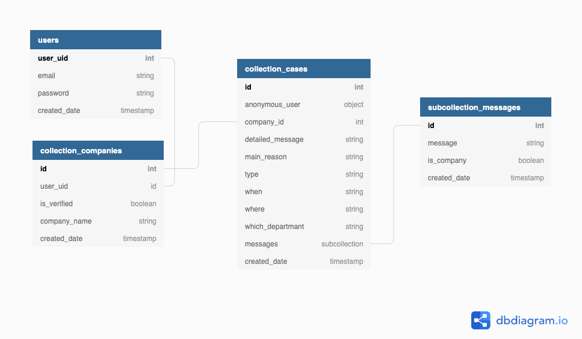

# Anonymous Reporting Tool "ART"

**Anonymous Reporting Tool** (ART) is a tool that allows users to send feedback, report harassment/bias, or ask questions anonymously to the app's publisher. Those whom in need to have a tool which allows their employees to send feedback, report harassment/bias, or ask questions anonymously, can use the tool or download the source code.

This tool always will work 100% FREE and won't be transformed into a product. We aim to make people available to send feedback, report harassment/bias, or ask questions anonymously to their companies while not requiring their companies to pay for this tool.

<!-- [If you want to get more information about the implementation click here.](#implementation-for-companies "If you want to get more information about the implementation click here.") -->

- Demo `WIP`
- [Why?](#why 'Why?')
- [How does it work?](#how-does-it-work 'How does it work?')
  - [Case Creation Dataset](#case-creation-dataset 'Case Creation Dataset')
- [How Anonymous it is?](#how-anonymous-it-is 'How Anonymous it is?')
  - Technical Aspect `WIP`
- [Final Concept](https://miro.com/app/board/o9J_lW60VQs=/ 'Full Concept')
- [Final Design](https://www.figma.com/file/TquNrHQ9d4TlC0z6DWeGbO/Untitled?node-id=13%3A159 'Full Design')
- [Project Structure](#project-structure 'Project Structure')
  - [Frontend](#frontend 'Frontend')
    - [Project Setup](#project-setup 'Project Setup')
  - [Backend](#backend 'Backend')
    - [Firebase](#firebase 'Firebase')
    - [Diagram](#diagram 'Diagram')
  - [Upcoming Challanges](#upcoming-challanges 'Upcoming Challanges')
- [Contributors](#contributors 'Contributors')

# Why?

In January 2021, We noticed that some companies needed a tool that provide the opportunity to their employees to anonymously report harassment and bias, discrimination, or abuse. We tried to look for such a tool but We couldn't find a suitable, fit product or even an open-source tool. We thought there must be a tool that, on a side, it's easy to be implemented by companies. And, on the other side, it would be as much anonymous as possible to make the app safer and extra secure for people who would experience problems such as; racism, discrimination, harassment/bias, or abuse in their workspace.

As a contributor, this tool is my personal attitude towards racism, harassment/bias, discrimination, and abuse that still happens worldwide.

## How does it work?

The tool doesn't require any personal data (e.g. name, surname, e-mail, phone number) to report a harassment/bias, send a feedback or ask a question. Instead, the tool requires only [case related details](#case-creation-dataset 'Case Creation Dataset'). It automatically creates an anonymous username and password, and assign it to the case. Then, it shares these credentials with the user before completing the case report process. Afterward, the user can login into the app anonymously to follow the created case's further updates.

### Case Creation Dataset

Here is what app receives to create a new case.

| Data                                                 | Options                                                                                                                 |
| ---------------------------------------------------- | ----------------------------------------------------------------------------------------------------------------------- |
| Feedback Type                                        | `General, feedback or questions` <br> `Culture Issues` <br>`Harassment or Bias`<br> `Diversity, equity, and inclusion`  |
| Did this happen to you or some else? <br> `optional` | `Me` <br> `Someone else`                                                                                                |
| Relationship to the company <br> `optional`          | `Current Employee` <br> `Former Employee` <br> `Interviewed there` <br> `Had a partnership relations with this company` |
| When did this happen?                                | `1-6 months` <br> `6-12 months` <br> `1 year ago` <br> `I don't remember`                                               |
| Which city did this happen?                          | `All cities can be selected.`                                                                                           |
| Which department did this happen?                    | Free text area                                                                                                          |
| Detailed Message                                     | Free text area                                                                                                          |
| Attachments                                          | Free file area (max 3 per time)                                                                                         |

## How Anonymous it is?

The tool doesn't need [any personal data](#how-does-it-work 'How does it work?'). Alternatively, it generates a unique username and password before completing the case report and displays it to the user. The user must protect these anonymous credentials as it will be needed to login into the app to be able for the user to follow their case's further updates. After receiving and saving the anonymous credentials, the app encrypts and stores them in the database. Even a developer will not be able to see the credentials at any stage of the case report process.

# Project Structure

text.

## Frontend

BEM, router, localization

### Project Setup

```
npm install
```

### Compiles and hot-reloads for development

```
npm run serve
```

### Compiles and minifies for production

```
npm run build
```

### Lints and fixes files

```
npm run lint
```

### Customize configuration

See [Configuration Reference](https://cli.vuejs.org/config/)

## Backend

Firebase

### Diagram



### Upcoming Challanges

- firebase
- stand-alone

# Contributors

- [Mehmet "Volkan" Deveci](https://github.com/volcanioo 'Mehmet Volkan Deveci')
- [Caner Elbeli](https://www.linkedin.com/in/caner-elbeli-87440819a/ 'Caner Elbeli')
- [Daniel González](http://github.com/metal-gogo/ 'Daniel González')
- [Linh Nguyen ](https://www.linkedin.com/in/linhnguyen1/ 'Linh Nguyen ')
- [Halit Salih](https://www.linkedin.com/in/-kale/ 'Halit Salih')
- [Dursun Can Aydin](https://www.linkedin.com/in/dcanaydin/ 'Dursun Can Aydin')
